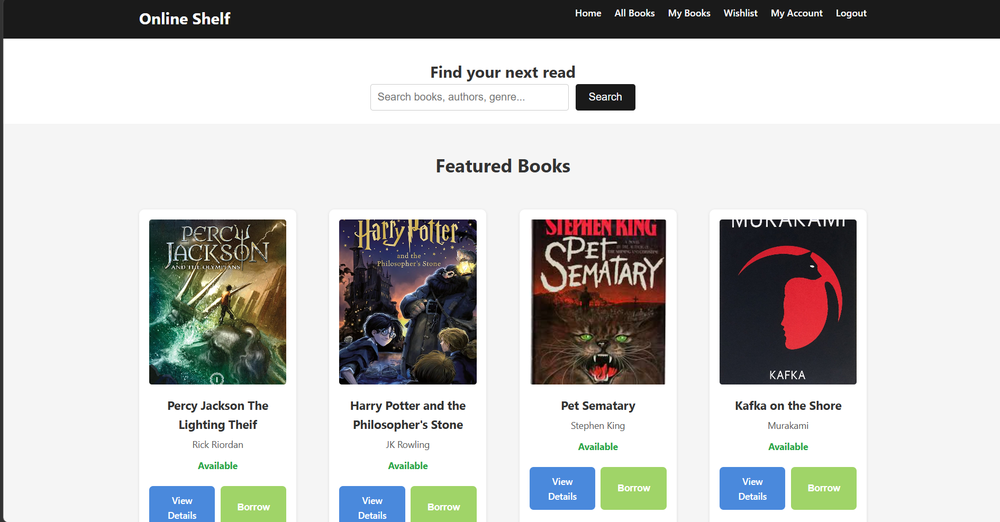
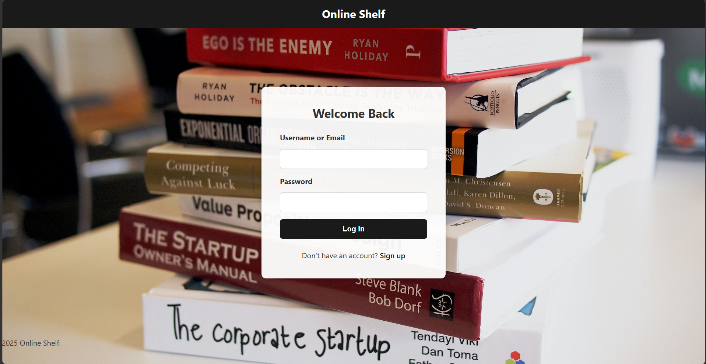
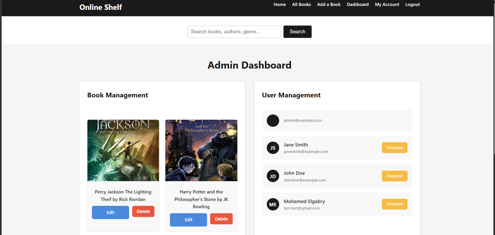
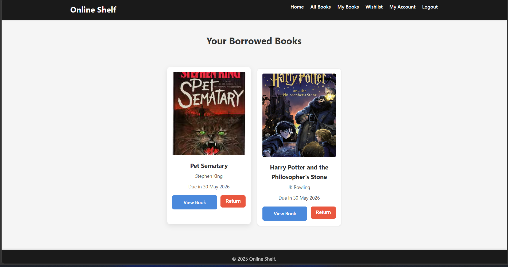

# Online Library

An Online Library web application built with Django that allows users to browse books, manage personal collections, and interact with an admin dashboard for book and user management.

---

## Features

### User Features

* User registration and login system
* Browse available books
* View detailed book information
* Search for books
* Add books to wishlist
* Manage personal book collections
* User dashboard

### Admin Features

* Add new books
* Edit existing books
* Delete/manage books
* Manage users
* Admin dashboard

### UI/UX

* Responsive design
* Clean and user-friendly interface
* Dynamic frontend interactions using JavaScript

---

## Technologies Used

* **Backend:** Python, Django
* **Frontend:** HTML5, CSS3, JavaScript
* **Database:** SQLite (default Django database)
* **Version Control:** Git & GitHub

---

## Project Structure

```bash
Online-Library/
│
├── library/             # Main application
├── templates/           # HTML templates
├── static/              # CSS, JavaScript, images
├── media/               # Uploaded media files
├── db.sqlite3           # Database
├── manage.py
└── README.md
```

---

## Installation & Setup

### 1. Clone the Repository

```bash
git clone https://github.com/your-username/online-library.git
cd online-library
```

### 2. Create a Virtual Environment

#### Windows

```bash
python -m venv venv
venv\Scripts\activate
```

#### macOS/Linux

```bash
python3 -m venv venv
source venv/bin/activate
```

---

### 3. Run Database Migrations

```bash
python manage.py migrate
```

---

### 4. Create a Superuser (Optional)

```bash
python manage.py createsuperuser
```

---

### 5. Start the Development Server

```bash
python manage.py runserver
```

Open your browser and go to:

```bash
http://127.0.0.1:8000/
```

---

## Screenshots

### Home Page


### Login Page


### Admin Dashboard


### My Books Page


## Future Improvements

* Book borrowing system
* Ratings and reviews
* Email notifications
* REST API integration
* Dark mode support
* Recommendation system

---

## Contributing

Contributions are welcome.

1. Fork the repository
2. Create a feature branch
3. Commit your changes
4. Push to your branch
5. Open a Pull Request

---

## License

This project is licensed under the MIT License.

---

## Author

Mohamed Elgabry
